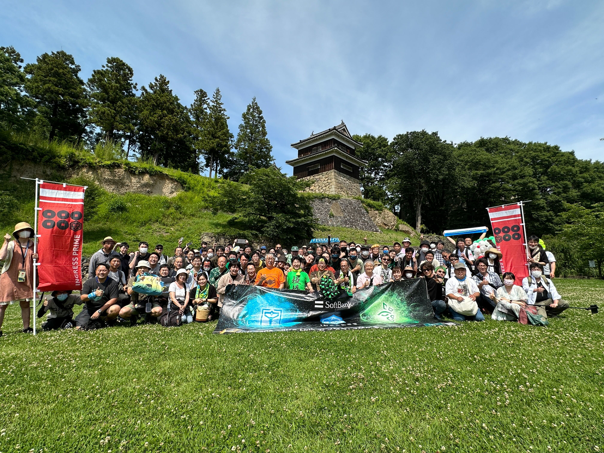

# Echo上田アノマリーことはじめ

**INGRESS 11周年おめでとうございます!**

この記事は、 [Ingress & Wayfarer(その２) Advent Calendar 2023](https://adventar.org/calendars/9027) 1日目の記事です。

2023年はNIANTICの方々、エージェントの方々といろいろとお世話になりました。感謝の気持ちでいっぱいです。

[rei0000](https://twitter.com/rei0000_enl) と申します。過去にイングレスをモチーフとしたミニゲームを作ったりもしています。

* 非公式Ingressかるた(ver.2020) & グリフ  
  https://reirei0000.github.io/ingress-advent-calendar-2020/ 
* Glyple  
  https://reirei0000.github.io/glyple/public/ 

今年は身近な場所でアノマリーが開催されました。
合う人合う人に「なんで上田市でアノマリーなの？」と言われました。それはなんでこんな小さな都市で開催するのといった疑問であったり、もっとふさわしい都市があるんじゃないといったものもあったような気もします。

そういえば、2月に上田アノマリーのアナウンスがあり、いろいろ準備したなと思い出します。
成功したものだけではありませんが、書いてみました。

## ファーストサタデー
上田市の知名度を上げるため、そして長野県のXFのチャンネルを改めて開くことの目的で開催しました。
アノマリーは陣営対抗のイベントではありますが、XFでの協調が必要です。文字だけのコミュニケーションは限界があり、実際に会って調整できたのは大きいと感じます。
これまでファーストサタデーの開催の経験活かせスムーズにいきましたし、初心者のためのイベントという枠を超えて、上田市を知って楽しめたという声も聞けて良かったです。

## GORUCK/OCF (開催へ向けての折衝)
私自身は GORUCKに関わったことはありませんが、熱心なユーザーが身近にいましたし、GORUCKの理念には共感を感じています。そこから詳しい方に開催できないか折衝を依頼しました。
残念ながら、上田アノマリーでの開催は実現できませんでしたが、日本のGORUCKERの熱意が伝わったような話を聞きました。

## ミッションデイ/頒布会
こちらに書いたとおりです。  
https://reirei0000.github.io/AdventCalendar/2023/mdshinshuueda/ 

  序盤の準備について書き足します。Echo上田アノマリーはサテライトということで、過去の実績からはMDが開催されるか不明でした。発表を待っていては準備期間が短くなるため、見切りで準備を開始しました。
個人的には2022年末の[MD横浜](https://sites.google.com/view/md2022yokohama)、頒布会、ミートアップ会場が素晴らしいもので印象に残っています。まずはそれをお手本として目指しました。
  * **交流会場**: 2月末の時点で探し始めましたが、すでにほぼ埋まっていました。頒布（販売）可の制限が大きく探すのに苦労しました。
  * **上田市日本遺産のテーマ**: 上田市在住の方にMDについてアドバイスいただきました。エージェントだけでなく自治体、商工会議所、観光協会の方々とお話できた経験は貴重なものとなっています。

これらに上げたものはいきなりできたわけではありません。2022年のクレーゼ、キテラアノマリーでもXFでNOGOのポータルの話し合いもありましたし、これまでイベントを開かれた方々の積み上げがあってのものとしみじみ感じています。

来年はもっと楽しいイングレスができると思ってます。
[Hack the planet!](https://twitter.com/brianrose)

Ingress & Wayfarer Advent Calendar 明日は [かなこさん](https://twitter.com/kanasumi_res)、[to1027meさん](https://twitter.com/to1027me)です。
