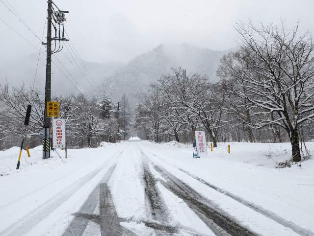
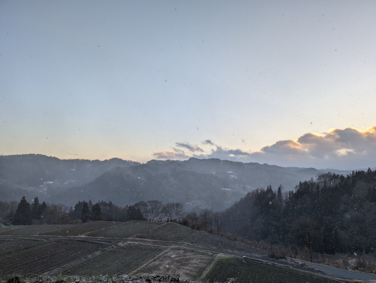
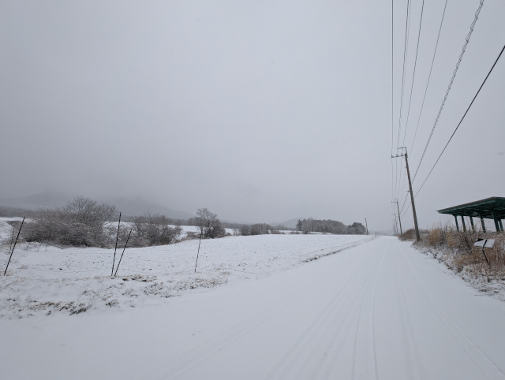
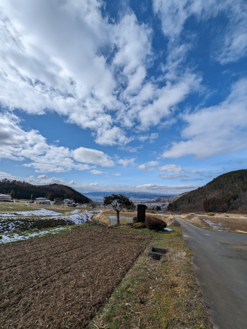
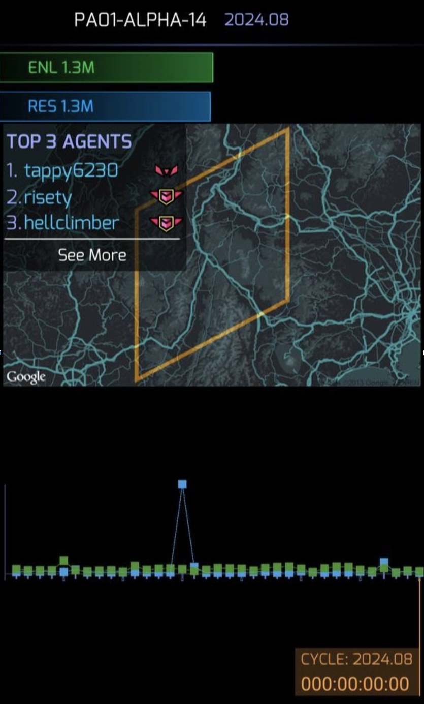
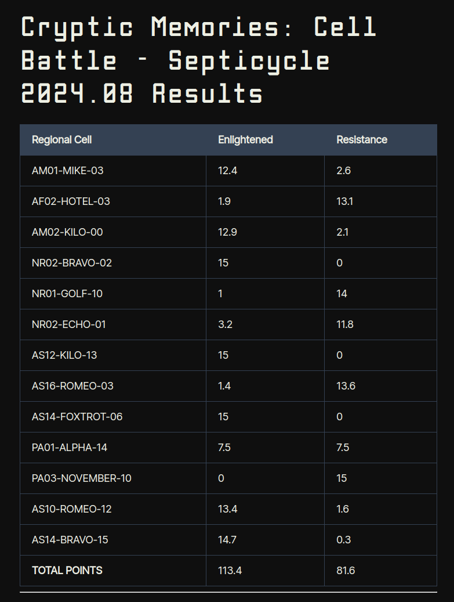
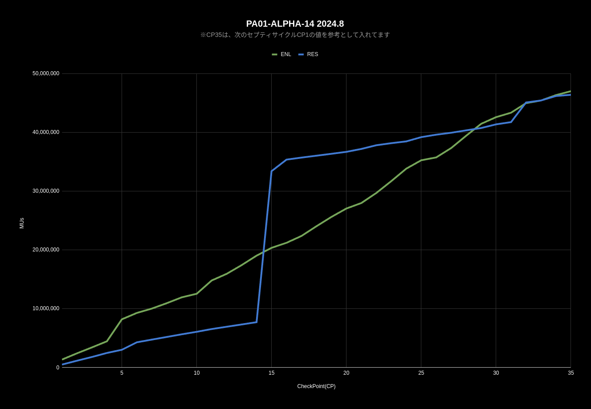

# NIA に愛されたセル PA01-ALPHA-14

この記事は、[Ingress & Wayfarer(その２) Advent Calendar 2024](https://adventar.org/calendars/10302) 2日目の記事です。

<iframe width=480 height=275 allow="clipboard-write" allowtransparency="true" class="fude-iframe-oembed-widget__iframe" frameborder="0" scrolling="no" src="https://adventar.org/calendars/10302/embed" loading="lazy"></iframe>

コロナ禍以降、セル「PA01-ALPHA-14」では毎年Ingress公式イベントが開催されています。その頻度の多さから「NIANTICに愛されているのでは？」という思いで、今回のタイトルを付けました。

### 近年長野県イベントリスト
* 2022/02 クレーゼ効果 / フェーズ２ (長野市)
* 2022/03 クレーゼ効果 / フィナーレ (長野市、安曇野市)
* 2022/05 [Kythera - Phase 3](https://ingress.com/ja/news/kythera-p3) (上田市)
* 2023/06 [Echo Anomaly Series - Rules](https://ingress.com/news/echo-rules) (上田市)
* 2023/06 [Ingress Mission Day](https://ingress.com/news/echo-rules) (上田市)
* 2024/02 [Cryptic Memories: Cell Battle](https://ingress.com/news/2024-crypticmem#cellbattle-2-results) (長野県および隣接県)

## セルバトル
2024年は2月に、Ingressの大型イベント「Cryptic Memories: Cell Battle」が開催されました。

私はこのイベントにおいて、長野県北部と東部を主な活動エリアとして参加しました。総走行距離は約3000km、ガソリン消費量は約150リットルにのぼりました。2月末の真冬日は厳しい寒さでしたが、いつもの生活の地で少し特別な戦いを楽しむことができました。

左上から
* 標高909.7m 大町市、長野県
* 標高595.3m [曹洞宗 明松寺](https://intel.ingress.com/?pll=36.62538,137.980115)
* 標高1281.7m [大地を拓く](https://intel.ingress.com/?pll=36.453341,138.476744)
* 標高654.6m [農魂の碑](https://intel.ingress.com/?pll=36.665782,138.365241)

セルバトルは、セプティサイクル1回分(175時間)の壮大な戦いです。長野県全域を含む本州全土を舞台にしたこの戦いは、単なるMUスコア争いではなく、Ingress史上トップ3に入る名勝負だったと自負しています。最後のCP28からの逆転劇に次ぐ逆転劇は、参加者だけでなく観戦していたエージェントたちの心にも深く刻まれたようです。

イベント後に会う人会う人から「長野セル戦、すごかったですね」「本当に面白かった」という言葉をたくさんいただきました。これは私が所属するエンライテンド陣営だけでなく、レジスタンス陣営のエージェントからも同様です。このような成功は、Ingress初期から築かれてきたクロスファクション（XF）での連携や、共にイベントを達成してきた仲間たちのおかげです。

さらに、普段は活動されていない方々や、過去の長野セル戦に参加できなかった方々からも「楽しかった」との感想をいただけたのは、とても嬉しいことでした。

X（旧Twitter）に投稿された記録からも、その壮絶さが垣間見えるでしょう。クリプティック・メモリーズ・アノマリー・シリーズ2024の第8節をまとめていますので、ぜひそちらもご覧ください。

[クリプティック・メモリーズ・アノマリー・シリーズ 2024.8節 をまとめました](https://togetter.com/li/2324070)

## セルバトル用語
* **セル (Cell)**: Ingressのゲームシステムでは、地球全体を24576個の小さな単位に分割し、それぞれを「セル（Cell）」と呼んでいます。今回セルバトルではその1つ、PA01-ALPHA-14 が選ばれました。
* **Mind Unit (MU)**: スコアの基準となる単位。コントロールフィールド（CF）の範囲内にいる人口を指します。例えば、100 MUならCF内に100人が含まれる計算です。多重CFの場合、その多重分も加算されます。今回は両陣営で日本全土人口にも匹敵する1億 MUs ともなるスコアとなりました
* **CheckPoint (CP)**: 5時間ごとに設けられるスコア計測のタイミング。この時点で存在するCFのMUがスコアとして計測されます。

## 結果
セルバトルの結果は、なんと「引き分け」でした。他のセルと比較しても、ここまで均衡したスコアになることは非常に珍しいようです。

[スコア](https://ingress.com/en/news/2024-crypticmem#cellbattle-2-results)

この結果に至るまでの過程を振り返ると、何度も逆転が繰り広げられた戦いでした。それだけに、参加者全員にとって忘れられない記憶となったのだと思います。

## おまけ
実は、「長野セル戦」と呼ばれる戦いは、10年前にも行われています。それが2014年42節（11/3-10）の[#Darsana Global](https://x.com/search?q=%23Darsana%20Global)です。当時はエンライテンドがレジスタンスに完敗しました。その時の長野レジスタンスリーダーが制作した動画が素晴らしい出来栄えなので、ぜひご覧ください

<iframe width="560" height="315" src="https://www.youtube.com/embed/0oecKqTKsuE?si=34EcZhw4f31zR7Kd" title="YouTube video player" frameborder="0" allow="accelerometer; autoplay; clipboard-write; encrypted-media; gyroscope; picture-in-picture; web-share" referrerpolicy="strict-origin-when-cross-origin" allowfullscreen></iframe>

YouTube: [Ingress #Darsana PA01-ALPHA-14](https://youtu.be/0oecKqTKsuE?si=GHFO6iZ9TY78ObnK)

明日(3日目)は [ドクターささけんさん](https://twitter.com/dr_sasaken") [Brian Roseさん](https://twitter.com/brianrose) です。
* [Ingress & Wayfarer(その１) Advent Calendar 2024](https://adventar.org/calendars/9996)
* [Ingress & Wayfarer(その２) Advent Calendar 2024](https://adventar.org/calendars/10302)

## 来年はどこへ

**NIAに愛されたセル「PA01-ALPHA-14」 来年もとてもたのしみです！**
