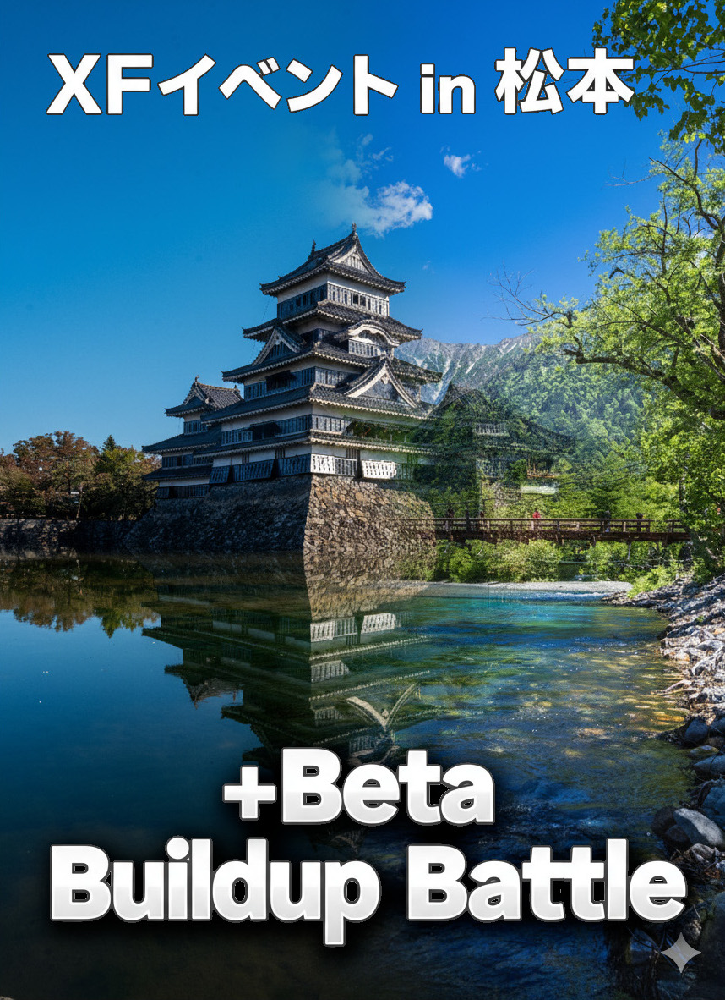

# 松本 +Beta Buildup Battles レポート

この記事は、[Ingress & Wayfarer(その２) Advent Calendar 2025](https://adventar.org/calendars/11701) 2日目の記事です。

<iframe width=480 height=375 allow="clipboard-write" allowtransparency="true" class="fude-iframe-oembed-widget__iframe" frameborder="0" scrolling="no" src="https://adventar.org/calendars/11506/embed" loading="lazy"></iframe>
<iframe width=480 height=375 allow="clipboard-write" allowtransparency="true" class="fude-iframe-oembed-widget__iframe" frameborder="0" scrolling="no" src="https://adventar.org/calendars/11701/embed" loading="lazy"></iframe>

## イベント概要

松本駅周辺を舞台に、+Betaトークン獲得を目的としたバトルイベントを開催しました。  
[公式ルール](https://ingress.com/news/2025-plusbeta-buildupbattles)

* イベント名: 松本 +Beta Buildup Battles 
* 開催日時: 2025年11月30日(日) 13:00〜17:00
* 場所: 松本駅お城口〜四柱神社周辺
  - 使用ポータル数: 延べ72個
* 主催者
  - [kuraken3](https://t.me/Kuraken3) (RES)
  - [rei0000](https://t.me/rei0000) (ENL)

## 広報
[🏔Ingress XF Nagano🏯  X](https://x.com/ingressxfnagano/status/1978765717421056384?s=20)

## 開催結果

当日は予想を超える多くの方にお集まりいただけました。

* 参加人数
  - 申込数 60人 (Telegram 参加人数、見学含む)
  - 実参加人数 40人ぐらい (集合写真＋ログをお見かけした方をカウントしました)
* 収支概算: 200円
  - 用途: ネットプリント代(バトルビーコンのデプロイ位置と担当確認用、および補給ポータル配置図の印刷)

## 当日のハイライト（定性情報・写真）

**「シールドなし（No Shield）」の縛りルール**
* 今回は特別ルールとして他の会場であった「Mod構成でシールドを入れない」という縛りを設けました。これにより、ポータルの防御力が下がり、激しい取り合いが発生。結果として、参加者からは **「物資が足りない！」「レゾが溶ける！」** といった嬉しい悲鳴（？）が多数上がりました。

物資枯渇が続出するほどの激戦となり、当初の想定以上に盛り上がりを見せました。

エリアはこんな感じで設定しました

Battle Beacon の投入ありがとうございました

## KPT（振り返り）

次回の開催に向けて、Keep（良かった点）、Problem（課題）、Try（改善案）を整理しました。

### ▼ Keep（良かった点）
* **目標達成** ：想定していた「+Beta トークン」を1,500pt 以上獲得できた。 
* **無事故** ：トラブルなく安全に終了できた。 
* **エリア選定** ：交通の便が良い場所を選んだことで、参加人数が予想より上振れした。 
* **公平さの担保** ：補給エリアを陣営毎に投票で選べた。

### ▼ Problem（課題・反省点）
* **エリア選定** ：せっかくの国宝松本城を入れられなかった。
* **準備の遅れ** ：参加人数の予測が難しく、エリア確定が遅れてしまった。
* **スケジュールの過密さ** ：バトルビーコン間の時間が短く、補給タイムが十分に取れなかった。
* **地元参加率** ：長野県地元の方々の参加が比較的少なかった。

### ▼ Try（次回への改善案）
* **規模拡大** ：開催場所（対象ポータル群）を増やす。
* **周知の徹底** ：エリアや特殊ルールについて、事前の参加者への周知を強化する。
* **ゆとりある進行** ：補給や移動を含め、余裕を持ったスケジュールを組む。

## 総括・まとめ

本イベントの最大の目的であった **「参加者の +Beta トークン取得」については、十分に達成できました。**

一方で、地元の方々の参加が予定の半分程度に留まった点は、今後の課題として受け止めています。次回は地元エージェントもより参加しやすく、また遠征組も楽しめるような企画にブラッシュアップしていきたいと思います。

参加された皆様、お疲れ様でした！

## 【結果共有】松本+Beta buildup battle アンケート

期間：12月2日〜12月5日 回答：17名 回収率 28.3%（ご協力ありがとうございます！）

頂いたご意見はみなさまの企画運営の参考にできるのではないかと思います。特にBB間の移動、スケジュールについては多くの反響を頂きました。詳細は以下をご覧ください。 👇

### その他のコメント
* ひさびさバトルがたのしかった
* 両陣営がルールを守って予定通り進められた

### その他のコメント
* これは自戒も含まれるのですが、スキャナーを操作しながら歩くAGさんが結構おられました。イベント中もAG同士で注意喚起（ながら歩きはやめましょう、自転車が通りますよ、など）ができればよかったな
* 補給ポータルのレベル構成を最適に指示できると、戦闘の継続性が上がった気がする。
* もう少し低レゾの使用が使われたらいいのに
* 特にありません。バトルビーコン間の時間はもっと短くてもよかったです
* BB投入タイミングが緑陣営に有利になるように投入された疑いが持たれてました。投入は陣営平等にすべきでしたね。
* VRBBのおかしな仕様
* なし
* インターバルが短く忙しかった

### その他のコメント
* 県外参加者におもてなししたかったですね。地元情報発信とか、打ち上げもやってみたかったです。記念ミッションも作りたかったです。

### 主催者へのメッセージや、その他ご意見・ご要望
  ※ 私信、エージェント名は削除しています
* お疲れ様でした😊
* 主催および取りまとめありがとうございました。主催された方々や参加されたみなさんのおかげで、存分に楽しめました。
* お疲れ様でした！
* XFのイベントとして、勝敗にこだわり過ぎないようアナウンスがあっても良かったと思います。とはいえ、とても楽しかったです。ありがとうございました！
* イベントはお出かけの理由になるので、何かあればまたお邪魔したいと思います
* 主催いただきありがとうございました
* 忙しい中お疲れ様でした。普段名前をお見かけする方々と会うきっかけができて良かったです。
* お疲れ様でした。私的事情であまりお力になれませんでした。折角の県内開催イベントで県外の方々のおもてなしが出来なかったのが最大の反省点です。イベント中楽しかったです。またよろしくお願いします。
* おかげさまで、金になりました。
* 準備どうもご苦労様でした。天気も良く無事成功してよかったですね。
* 開催ありがとうございました
* 企画立案、運営ありがとうございました。お疲れ様でした。
* 企画、運営お疲れ様でした。ありがとうございました！
