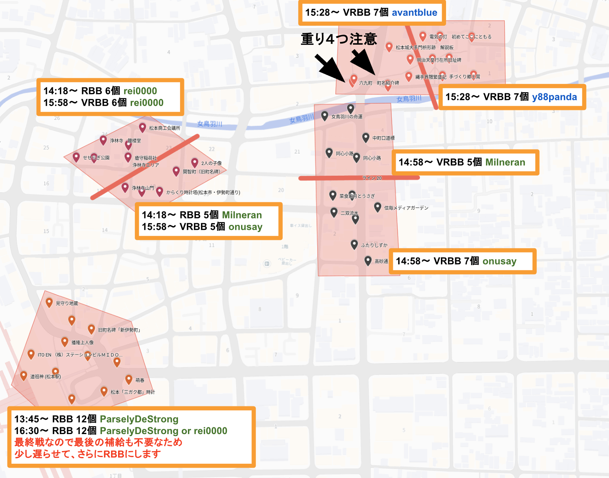
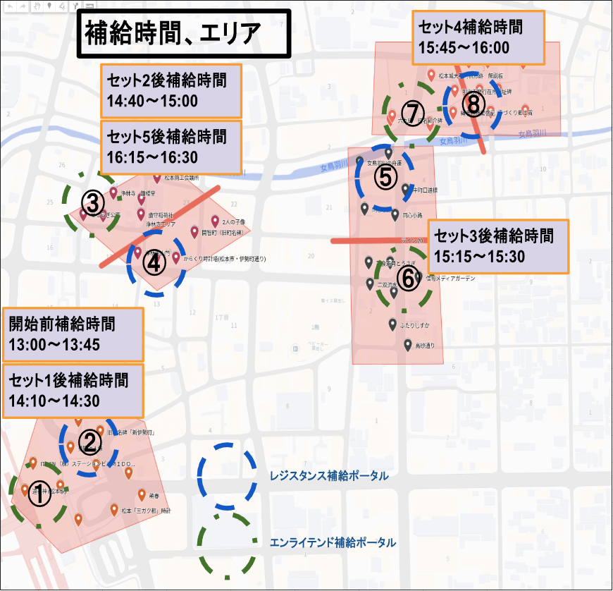

# 松本 +Buildup Battle レポート

この記事は、[Ingress & Wayfarer(その２) Advent Calendar 2025](https://adventar.org/calendars/11701) 2日目の記事です。

<iframe width=480 height=375 allow="clipboard-write" allowtransparency="true" class="fude-iframe-oembed-widget__iframe" frameborder="0" scrolling="no" src="https://adventar.org/calendars/11506/embed" loading="lazy"></iframe>
<iframe width=480 height=375 allow="clipboard-write" allowtransparency="true" class="fude-iframe-oembed-widget__iframe" frameborder="0" scrolling="no" src="https://adventar.org/calendars/11701/embed" loading="lazy"></iframe>

## イベント概要

松本駅周辺を舞台に、+Betaトークン獲得を目的としたバトルイベントを開催しました。

* イベント名: 松本 +Buildup Battle 
* 開催日時: 2025年11月30日(日) 13:00〜17:00
* 場所: 松本駅お城口〜四柱神社周辺
  - 使用ポータル数: 延べ72個
* 主催者
  - Kuraken3 (RES)
  - rei0000 (ENL)
  

## 開催結果

当日は予想を超える多くの方にお集まりいただけました。

* 参加人数
  - 申込数 60人 (Telegram 参加人数、見学含む)
  - 実参加人数 40人ぐらい (集合写真＋ログでお見かけしたをカウントしました)
* 収支概算: 200円
  - 用途: ネットプリント代(バトルビーコンのデプロイ位置と担当確認用、および補給ポータル配置図の印刷)

## 当日のハイライト（定性情報・写真）

  **「シールドなし（No Shield）」の縛りルール** 今回は特別ルールとして他の会場であった「Mod構成でシールドを入れない」という縛りを設けました。これにより、ポータルの防御力が下がり、激しい取り合いが発生。結果として、参加者からは **「物資が足りない！」「レゾが溶ける！」** といった嬉しい悲鳴（？）が多数上がりました。

物資枯渇が続出するほどの激戦となり、当初の想定以上に盛り上がりを見せました。

エリアはこんな感じで設定しました

Battle Beacon 投入ありがとうございました

## KPT（振り返り）

次回の開催に向けて、Keep（良かった点）、Problem（課題）、Try（改善案）を整理しました。

### ▼ Keep（良かった点）
* **目標達成** ：想定していた「+Beta トークン」を1,500pt 以上獲得できた。 
* **無事故** ：トラブルなく安全に終了できた。 
* **エリア選定** ：交通の便が良い場所を選んだことで、参加人数が予想より上振れした。 
* **公平さの担保** ：補給エリアを陣営毎に投票で選べた。

### ▼ Problem（課題・反省点）
* **エリア選定** ：せっかくの国宝松本城を入れられなかった。
* **準備の遅れ** ：参加人数の予測が難しく、エリア確定が遅れてしまった。
* **スケジュールの過密さ** ：バトルビーコン間の時間が短く、補給タイムが十分に取れなかった。
* **地元参加率** ：長野県地元の方々の参加が比較的少なかった。

### ▼ Try（次回への改善案）
* **規模拡大** ：開催場所（対象ポータル群）を増やす。
* **周知の徹底** ：エリアや特殊ルールについて、事前の参加者への周知を強化する。
* **ゆとりある進行** ：補給や移動を含め、余裕を持ったスケジュールを組む。

## 総括・まとめ

本イベントの最大の目的であった **「参加者の +Beta トークン取得」については、十分に達成できました。**

一方で、地元の方々の参加が予定の半分程度に留まった点は、今後の課題として受け止めています。次回は地元エージェントもより参加しやすく、また遠征組も楽しめるような企画にブラッシュアップしていきたいと思います。

参加された皆様、お疲れ様でした！
